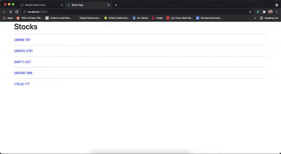

# **Gatsby-Robinhood**
My project for Gatsby Events' Simple Robinhood challenge!




## **Table of Contents**

- [About](#about)
- [Getting Started](#getting_started)
- [Usage](#usage)

## **About <a name = "about"></a>**
The challenge was to build a simple Robinhood-like web app that allows the user to view up to date information on a list of tickers. To do this, I created a: 

* React Hooks based web site to show up to date ticker information

* Node server to handle API requests

* fake "NASDAQ" API which provides ticker information to the Node API server.

## **Getting Started <a name = "getting_started"></a>**

These instructions will get you a copy of the project up and running on your local machine for development and testing purposes.

### ***Prerequisites***

This project uses [MongoDB](https://mongodb.com/) and [Node.js](https://nodejs.org/), so make sure you have those installed.

### ***Installing***

Below is a step-by-step guide to getting the project up and running on your local machine:

***[/frontend](https://github.com/logan-ankenbrandt/Gatsby-Robinhood/blob/main/frontend/)***

Run this in the `/frontend` directory

```
$ cd frontend
$ npm install
$ npm start
```

***[/api](https://github.com/logan-ankenbrandt/Gatsby-Robinhood/blob/main/api/)***

Run this in the `/api` directory

```
$ cd api
$ npm install
```


***[/server](https://github.com/logan-ankenbrandt/Gatsby-Robinhood/blob/main/server/)***

Open two terminal windows, and run this in the `/server` directory

*Terminal #1 (for basic installation & starting the server)* 

```
$ cd server
$ npm install
$ npm start
```

*Terminal #2 (for seeding & deleting the contents of the database)*

```
$ cd server
$ npm run seed
$ npm run delete
```


## **Usage <a name = "usage"></a>**

Navigate [here](http://localhost:3000/) to view the app!
